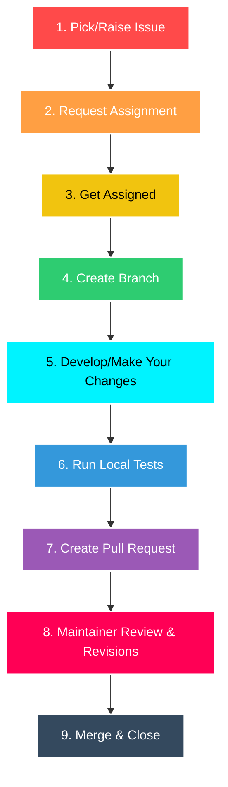

# 🧲 The Contribution Lifecycle

### A successful contribution is a result of a structured journey. Let's look at the standard roadmap of a professional and meaningful contribution from beginning to merge.

---

## The 9-Step Lifecycle

---

### 1. Pick/Raise Issue:
Locate an existing issue or raise a new issue with a well-defined problem statement and your proposed solution/changes.

 

_Existing Issues_

  

_Raising a New Issue_

---

### 2. Request Assignment:
Coordinate with maintainers/project admins requesting them to assign you to your issue.

---

### 3. Get Assigned:
Wait for the maintainer to assign the issue to you so you don't duplicate work.

 

---

### 4. Create Branch:
Checkout a feature branch from the latest `main`.

 

---

### 5. Development/Making Changes:
Write clean code, following the project style guide.

 

---

### 6. Testing:
Run test suites locally to ensure no regressions occur.

---

### 7. Open Pull Request:
Open a PR detailing _why_ and _how_ changes were made.

 

---

### 8. Review & Revisions:
Reviewers request comments or edits. You apply changes according to their needs.

---

### 9. Merge & Close:
The core maintainer merges the branch and closes the issue.

 

