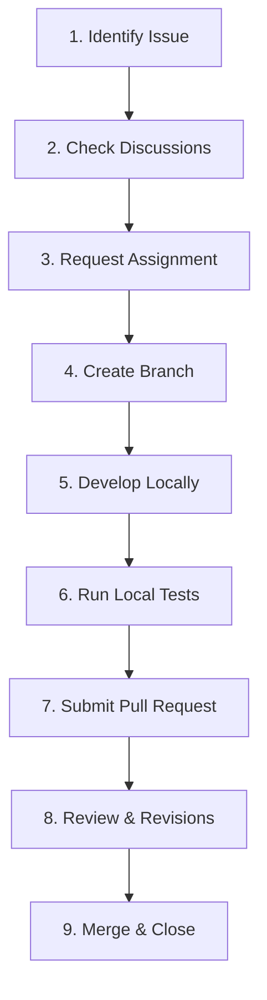

# The PR Lifecycle

A successful contribution is a structured journey. Let's look at the standard roadmap of a professional contribution from beginning to merge.

---

### The 9-Step Lifecycle

1. **Issue**: Locate an existing issue or report a bug.
2. **Discussion**: Coordinate with maintainers about how you plan to solve the problem.
3. **Assignment**: Wait for the maintainer to assign the issue to you so you don't duplicate work.
4. **Branch**: Checkout a feature branch from the latest `main`.
5. **Development**: Write clean code, following the project style guide.
6. **Testing**: Run test suites locally to ensure no regressions occur.
7. **Pull Request**: Open a PR detailing _why_ and _how_ changes were made.
8. **Review**: Reviewers request comments or edits. You apply changes.
9. **Merge**: The core maintainer merges the branch and closes the issue.
