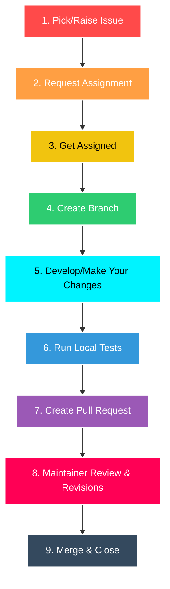

## 🧲 The Contribution Lifecycle — From Start to Merge

A successful contribution isn't random — it follows a clear path. Think of it like **baking a cake from a recipe**. You gather ingredients, follow steps, check your work, and finally present it. If you skip a step, the cake might not turn out right.

Let's walk through the nine steps of a professional contribution.

---

## The 9-Step Lifecycle



---

### 1. Pick or Raise an Issue

Find an existing issue that interests you, or create a new one describing what you want to do.

Think of this like **choosing a recipe**. You wouldn't start cooking without knowing what you're making!


---

### 2. Request Assignment

Leave a comment on the issue saying you'd like to work on it. This prevents two people from doing the same work at the same time.

---

### 3. Get Assigned

Wait for a maintainer to officially assign the issue to you. Now it's yours!


---

### 4. Create a Branch

Create a new branch from the latest `main` — this keeps your work separate and organized.

```bash
git switch -c feat/my-feature
```


---

### 5. Make Your Changes

Write clean code that follows the project's style guide. Keep your changes focused on just one thing.


---

### 6. Run Tests

Run the project's test suite to make sure you haven't broken anything. If there are no tests for your change, consider adding some!

---

### 7. Open a Pull Request

Push your branch and open a PR. Explain *why* the change is needed and *how* you implemented it.

---

### 8. Review and Revise

Maintainers will review your code and might request changes. Don't worry — this is normal! Make the updates and push to the same branch. The PR updates automatically.

---

### 9. Merge and Close

Once everything looks good, a maintainer merges your code into the project. The issue is closed, and your contribution is live!


---

### 🧠 Key Takeaway

The contribution lifecycle has nine steps: pick an issue, get assigned, branch, code, test, PR, review, merge, celebrate. Follow this path every time, and you'll be a reliable contributor that maintainers trust.
